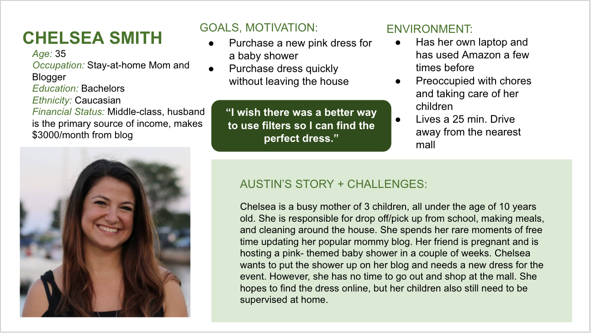
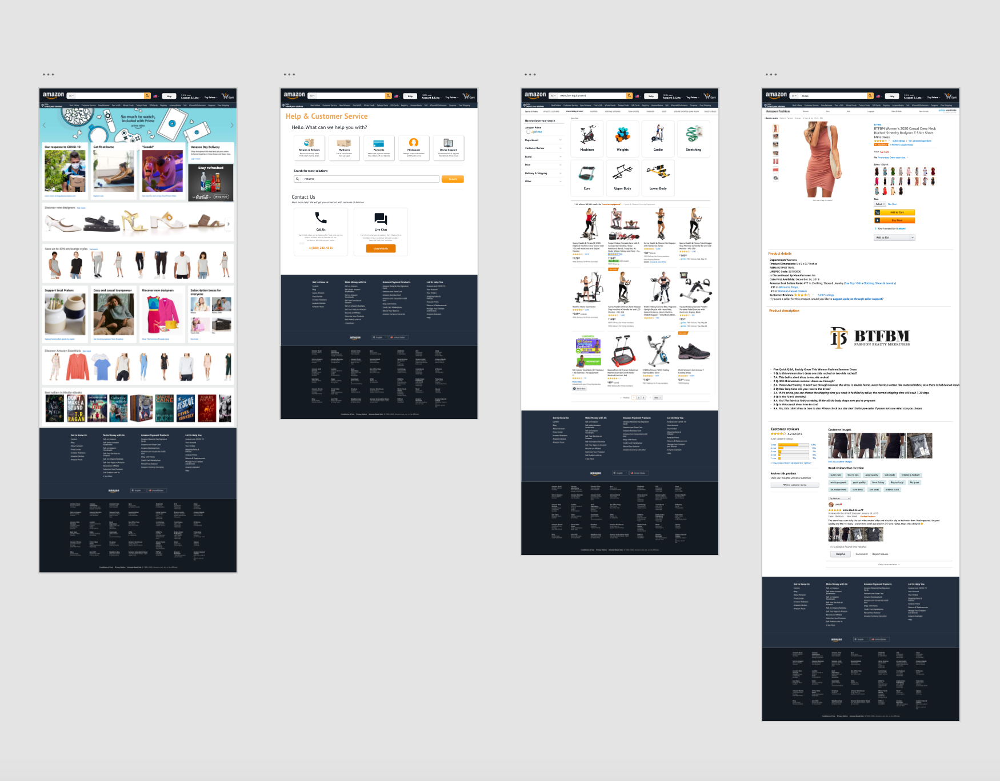
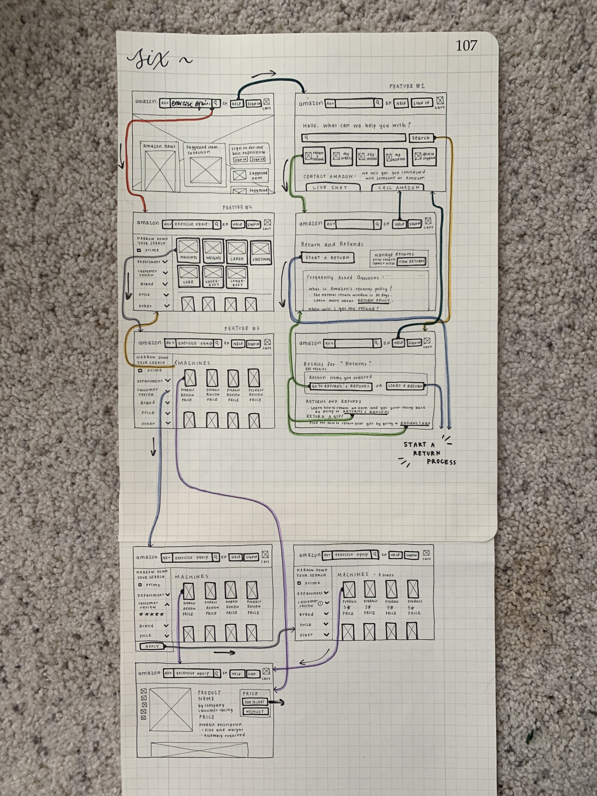
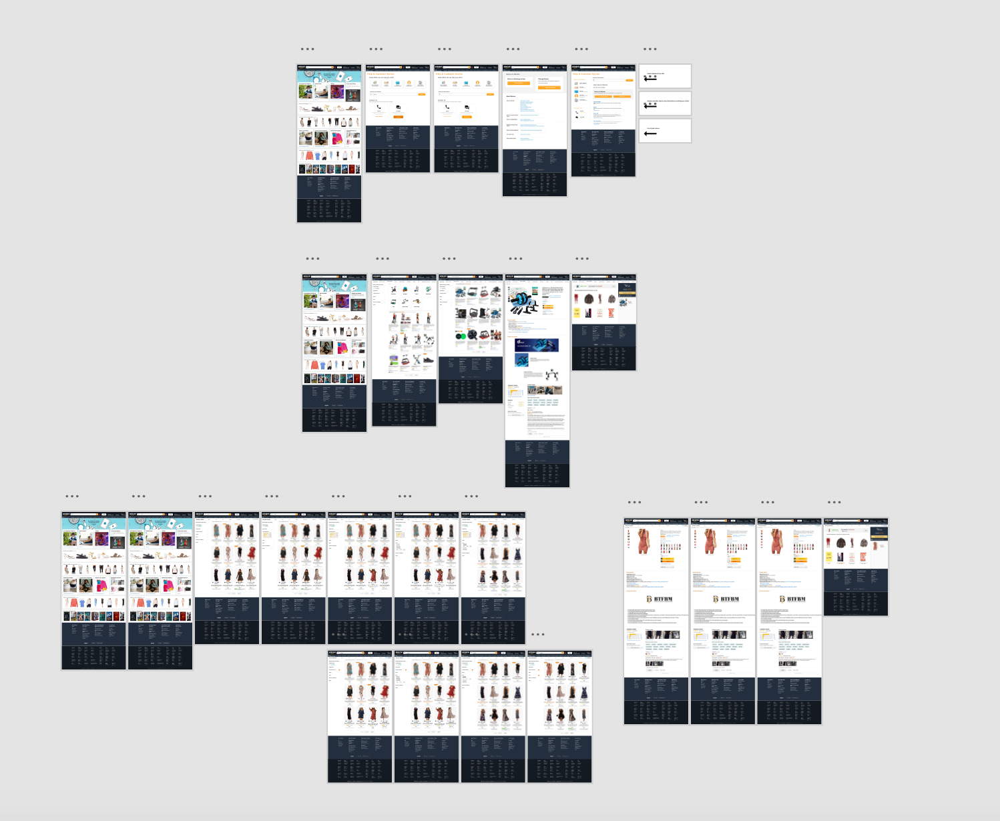
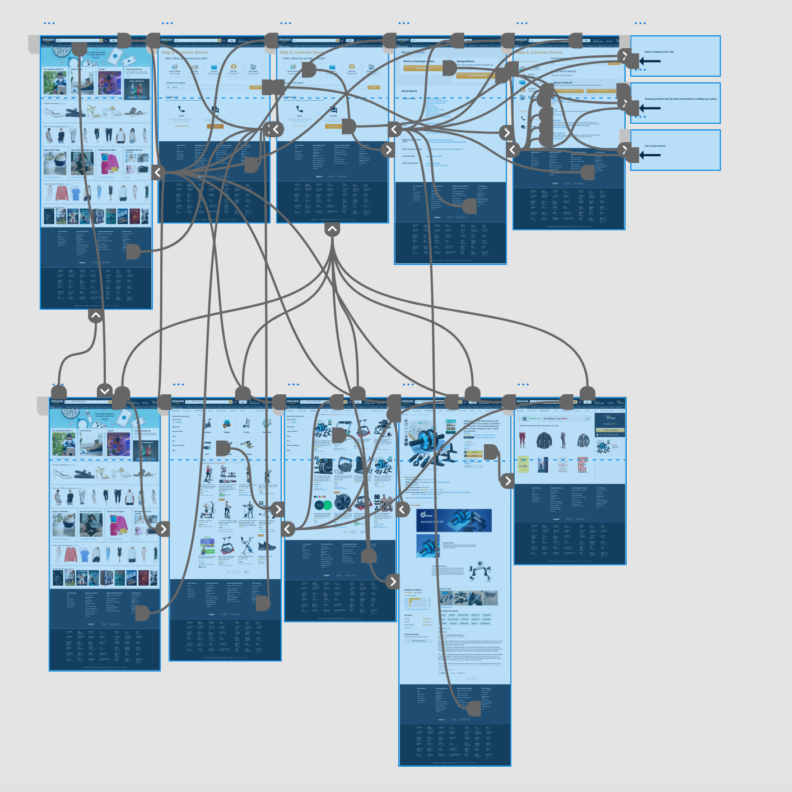
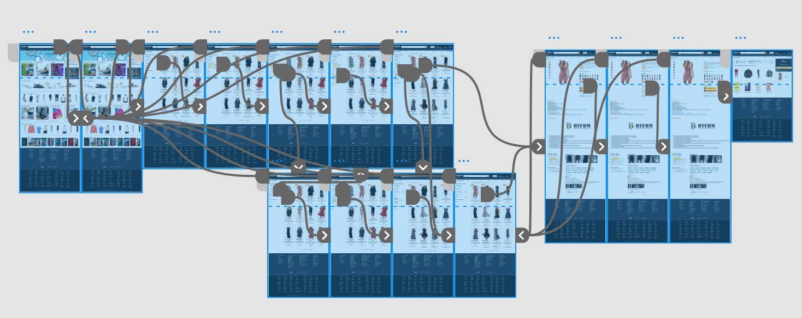

# Amazon Redesign
## Claire Guo

### Introduction
More and more people are using online ecommerce retailers to obtain products they need or want. Especially with stay-at-home orders in place due to COVID-19, more people are turning to online shopping methods not only because they are being encouraged to avoid in-store shopping as much as possible, but also in finding products that they can not find in stores. This past year, Amazon alone accounted for 40% of online retail and 43% of e-commerce gains in 2019 according to Internet Retailer. Despite being one of the most powerful brands and largest ecommerce retailers, Amazon's shopping experience can be difficult and overwhelming for users. With this project, I want to increase Amazon's accessibility by removing frustration and errors from the shopping process. Through redesigning Amazon's user experience, I hope to support the community by making it easier for all people to easily obtain products and resources they need, especially when it is difficult for them to leave their homes.

### Design statement: 
**How might I design an accessible shopping experience that all users can use quickly, efficienty, and without frustration?**

Amazon serves as a one-stop shop. Amazon's wide-range of products and services attract a lot of people to their site, making it a very well-known and widely-used online shopping platform. Keeping this in mind, it is important that Amazon provides an effortless and delightful user experience for all of its users, including first-time users and those with less technological experience, so that all people can have access to Amazon's efficient method of purchasing necessary items.
Amazon takes advantage of its benefits of being an online platform, such that it contains a wide variety of products and services from different brands and departments. However, the abundance of information and product options can easily be overwhelming for users. In order to make the shopping experience more enjoyable, Amazon should attempt to maintain the personalized experience of shopping in physical stores. 
Through my project, I want to create a comfortable and effortless online shopping experience that accomodates all users and their shopping needs/wants. My designs aim to make Amazon more accessible, easy to use, and enjoyable, so that it will not be burdensome for users to purchase the items they need.  

### Competitor analysis: Heuristic Evaluation
I conducted a heuristic evaluation on the current Amazon website in order to clearly identify frustrating UX faults. While Amazon did not seem to have many severe usability issues, upon inspection, I found issues in Amazon's lack of help, consistency, and minimalist design, which could ultimately prevent an enjoyable and accessible shopping experience.
I also conducted a heuristic evaluation on Coursicle, a class enrollment website, which allowed me to get a sense of how other, more primitive and simple, sites presented product information and filtered through a wide-range of options.

[Read more >>](https://github.com/claireg22/DH150-ASSIGNMENT)

### Competitor analysis: Usability Testing
User-tesing is needed for successful user-centered design because it tests the usability of a product in order to make sure it is designed so that a real world user can accurately complete tasks or goals, enjoy using the product, and be willing to use it again. I conducted a pilot user test on the current Amazon website in order to observe users interact with Amazon in real-world scenerios such as adding items into the cart, finding help, and using Amazon's filtering system. After completing the usability test, I found that user's previous experience with the website greatly influenced how efficiently the user completed each task.

[Read more >>](https://github.com/claireg22/DH150-ASSIGNMENT02)

### User research:
I conducted user research for Amazon through participatory observation and found that users preferred to buy certain items online vs. in person and enjoyed "window-shopping" and looking at things they probably would not buy. This made me realize that sometimes users are not looking for the quickest, most efficient method to finding items they want or need, they also want to enjoy the adventure of finding and purchasing their items. 

[Read more >>](https://github.com/claireg22/DH150-ASSIGNMENT04)

### UX storytelling 
UX storytelling puts a human face on dry data and research and ensures that the improvements made in the product are user-centered. In order to understand why our product is used, how it can be used to resolve conflicts in our user's lives, and how users may feel when they use the product, we can create personas, scenarios, and empathy maps. UX storytelling puts our product into the hands of our potential users so we can understand their motivations, needs, and goals.
From my contextual inquiry findings and target demographics, I created three different personas and walked through their emotional journies as they navigated through the tasks presented in each of their scenerios.

[Read more >>](https://github.com/claireg22/DH150-ASSIGNMENT05)

### Wireframe and graphic design element variation 

I built off of Amazon's existing color palette to choose colors for the background and buttons. To preserve consistency, I used the orange colors on buttons and other usable features to show that they were clickable and interactive, and I found a similar sans-serif font similar to Amazon's "Ember" font to create my own buttons and descriptions. I used screenshots from Amazon, but I added, removed, and moved features around to create a de-cluttered and clean look for the new site. 

[Read more about wireframes >>](https://github.com/claireg22/DH150-ASSIGNMENT06)
[Read more about graphic design elements>>](https://github.com/claireg22/DH150-ASSIGNMENT07)

### Low-fidelity prototype 
In my new design of Amazon's user experience, I added three features to make the site more accessible and enjoyable to use:

1. Categorical organization of search results
2. Easy access to a help page with contact information to Amazon
3. Concise filter settings

I created low-fidelity prototypes to check and test the functionality of these three new design elements.
Creating hand-drawn screens and design flows allowed me to translate my high-level design concepts into physical and tangible entities that other people could interact with in order to identify functionality flaws. My low-fidelity prototype was used to test how the features I proposed flowed within a user's online shopping experience, and focuses on its practicality rather than visual appearance.

[Read more >>](https://github.com/claireg22/DH150-ASSIGNMENT06)

### High-fidelity prototype 
I used AdobeXD to create an interactive high-fidelity prototype of my new Amazon design to study the functionality and usability of my new design features. The high-fidelity prototype includes more visual design information, such as graphic elements, colors, UI components, and familiar Amazon features. High-fidelity prototypes are interactive, validate the user interaction flow, and help find possible shortcomings to designs that need to be improved.

Link to the [Interactive Prototype for the first two design elements](https://xd.adobe.com/view/caf758a8-381b-4968-6228-3a4e34c17f16-bcc6/)

Link to the [Interactive Prototype for the third design element](https://xd.adobe.com/view/6699da20-dd69-4436-6d18-15133e8c265e-10a8/)

[Read more >>](https://github.com/claireg22/DH150-ASSIGNMENT07)

### Evaluation and revision history 
#### Impression test and cognitive walkthroughs
I conducted an impression test and cognitive walkthrough with three classmates and two additional usability tests.
Through both the impression test and cognitive walkthrough, where I was able to capture the users' first impression of the newly designed website and their perspectives while navigating through tasks, I received positive responses regarding the new minimalistic design and received input in how to make design elements on the screens more consistent. 

[Read more >>](https://github.com/claireg22/DH150-ASSIGNMENT07)

#### Usability tests

Furthermore, I found that users were able to quickly navigate through tests through the usability tests and the new design elements were integrated well into the site visually. However, I could have been more bold with my design changes. 

Usability testing videos:

UT #1: https://youtu.be/-ixLABqAEtI 

UT #2: https://youtu.be/F3bf5_iTH-c

### Pitch video 
n/a
### Conclusion
In the beginning of this quarter, I challenged myself to analyze and improve the usability of Amazon, a very well-known and highly-regarded ecommerce retailer. Moreover, in a time where people are avoiding in-store shopping and looking to online sites to purchase necessary items, I realized that it was necessary for Amazon to make their site more accessible and easy to use. I decided to re-design Amazon's user experience as a service to my community, in order to allow all users, no matter their age or background, to be able to use the site without being overwhelmed.
Through this project, I learned the design process, starting out with understanding important user experience design methods and analyzing existing sites with these methods in mind. I learned how to serve as a non-biased moderator and how to analzye user results to implement them into my new designs. Most importantly, I learned that improving the user experience for a website starts with the user and aims at creating an efficient and effortless user flow. Instead of focusing on how cool the user interface designed looked, I learned to prioritize the functionality of the website while incorporating design elements in efficient ways to create a usable and minimalistic design.

